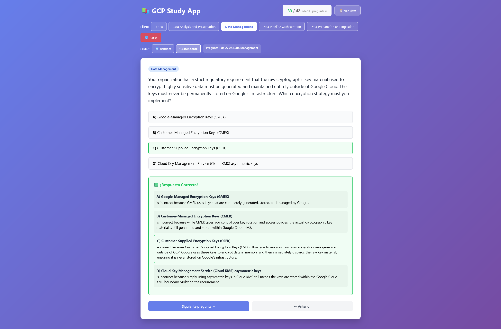

# GCP Study App

An interactive web application for studying Google Cloud Platform questions with detailed explanations, topic filtering, and score tracking.

## Overview

This application provides 110 practice questions across four Google Cloud study domains:
- Data Analysis and Presentation
- Data Management
- Data Pipeline Orchestration
- Data Preparation and Ingestion

Questions are sourced from online documentation and educational materials, with some synthetically generated to complement the curriculum. Each question includes detailed explanations for all answer options.

## Features

- 110 GCP practice questions with 4 options each
- Detailed explanations for every option
- Topic filtering to focus on specific areas
- Session-based score tracking (X/Y format)
- Responsive design for desktop, tablet, and mobile
- Question selection from full list
- Random question generation

## Screenshots



## Requirements

- Python 3.8+
- pip

## Installation

1. Clone the repository:
   ```bash
   git clone https://github.com/your-username/StudyGCP.git
   cd StudyGCP
   ```

2. Create a virtual environment (recommended):
   ```bash
   python -m venv .venv
   .venv\Scripts\activate
   ```

3. Install dependencies:
   ```bash
   pip install -r requirements.txt
   ```

4. Populate the database:
   ```bash
   python scripts/create_db.py
   python scripts/import_csv_to_sqlite.py
   ```

5. Verify the database:
   ```bash
   python scripts/verify_db.py
   ```

## Running the Application

Start the application:
```bash
python app.py
```

Alternatively, on Windows, you can use the quick launcher script:
```bash
run_study_app.bat
```

This batch script automatically creates the virtual environment (if needed), activates it, installs dependencies, and starts the application.

Open your browser and navigate to `http://localhost:5000`

To stop the application, press `CTRL+C` in the terminal.

## Project Structure

```
├── app.py                          # Flask application
├── requirements.txt                # Python dependencies
├── data/
│   └── processed/
│       └── questions.csv           # Question data
├── scripts/
│   ├── create_db.py               # Initialize SQLite database
│   ├── import_csv_to_sqlite.py    # Import questions from CSV
│   ├── docx_to_csv.py             # Convert DOCX to CSV format
│   └── verify_db.py               # Verify database integrity
└── templates/
    ├── question.html              # Question display template
    └── questions_list.html        # Questions list template
```